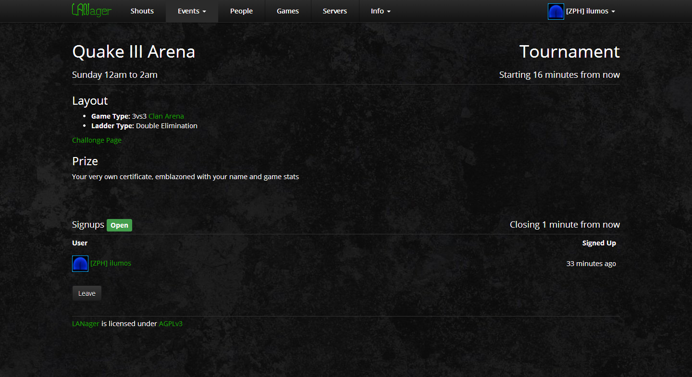
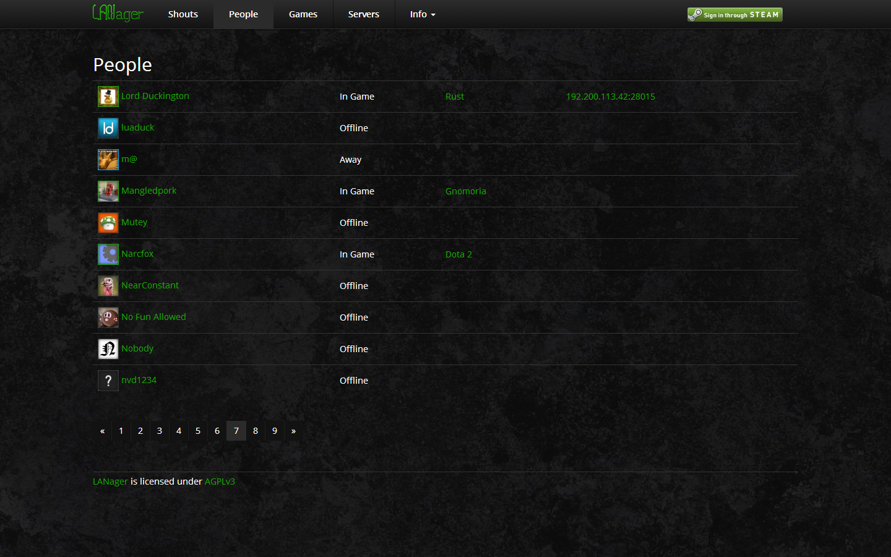
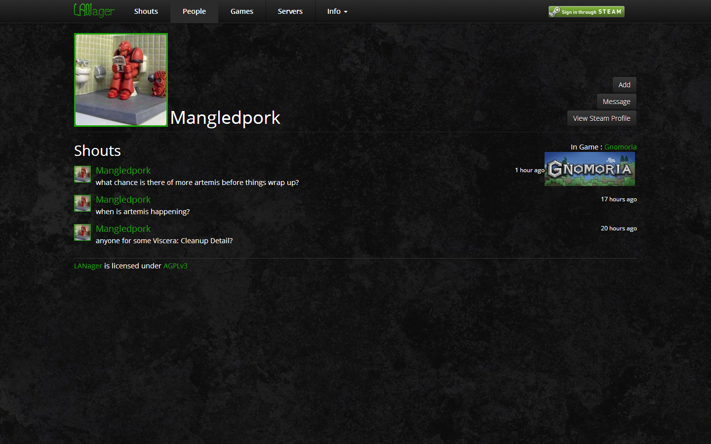
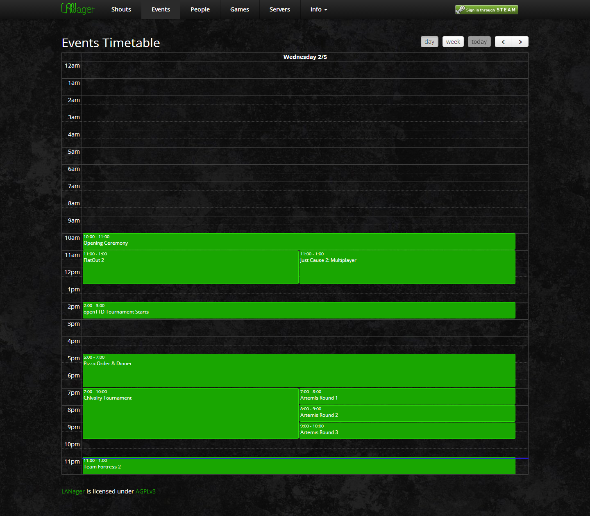
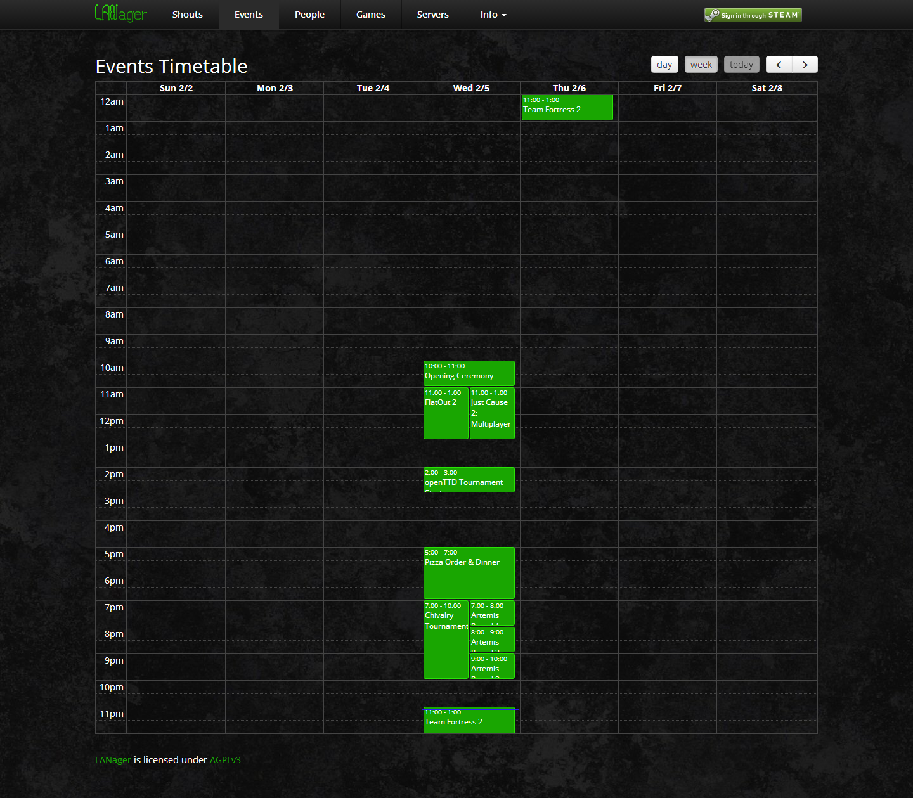
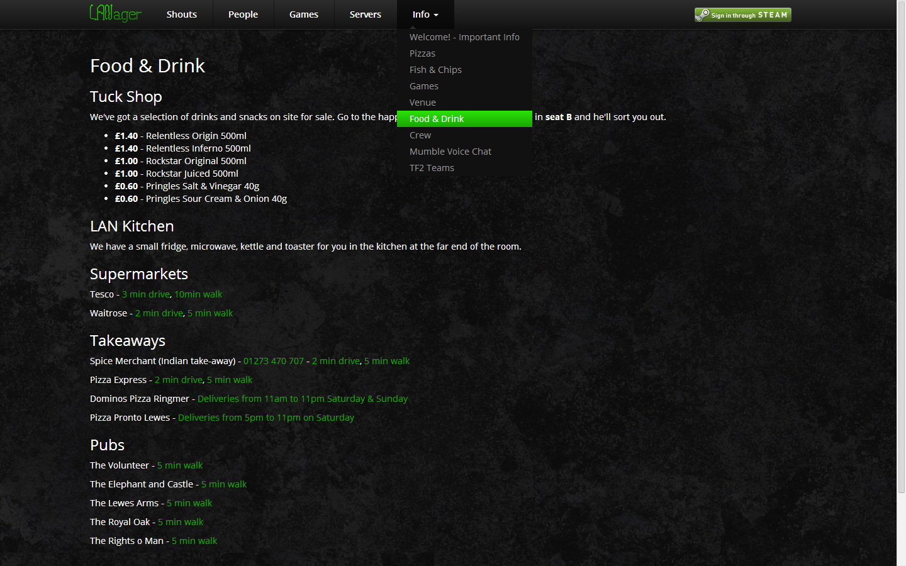
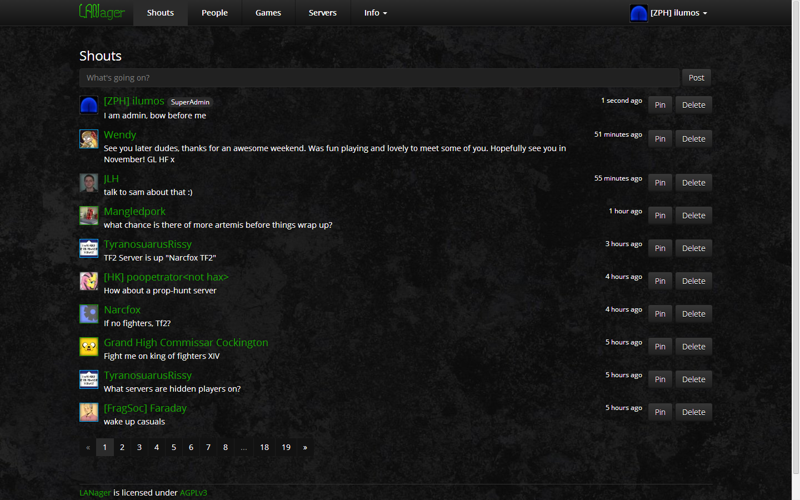
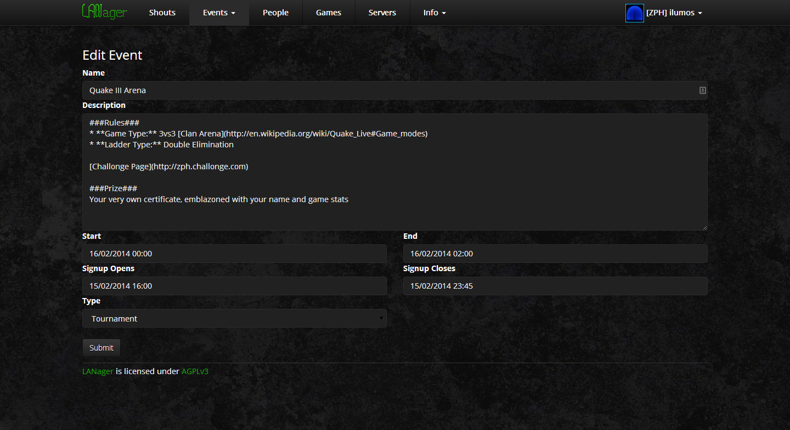

LANager
=======

LANager is a web application designed to make [LAN Parties](https://en.wikipedia.org/wiki/Lan_party)
more enjoyable for attendees and organisers alike.

## Features

### Enhance Participation

* **Games in progress**, updated every minute from Steam
* **Timetable of events**, optionally allowing users to sign up to events
* **Achievements**, created by admins, and awardable to attendees

### Boost Social Interaction
* **Attendee profiles** with links to add or message on Steam
* **Attendee list** with their current status

### Broadcast Useful Information
* **Info pages** for attendees to find out about the venue, rules etc, editable by admins 
* **Links** to other sites e.g. game stats, organiser's website 
* **Shouts** allowing attendees and admins to broadcast short messages
* **Live Dashboard** showing current and next events, games in progress and shouts, for big screen display

### Open for Integration
* **RESTful API** with open read access and API key guarded write access to all resources
* **Events dispatcher** allowing for hooking in of extra operations 
* **Comprehensive logging** of events allowing for debugging and auditing

And much more planned - check the [issue tracker](https://github.com/zeropingheroes/lanager-core/issues?labels=enhancement&milestone=&page=1&state=open) for future enhancements

# Screenshots
















## Requirements
* Web server - *Apache 2.4.x recommended*
* Database server - *MySQL 5.5.x recommended*
* Git 1.9.x
* PHP 5.6.x
* Composer 1.x
* A [Steam Account](https://store.steampowered.com/join/)
* An Internet connection
* Shell access to the server - **basic web hosting alone will not work!** 

## Installation on Ubuntu Server 14.04

*Advanced users will be able to deploy LANager to Windows and OS X, though LANager has not been fully tested on these OSes.*

1. Install the project's packaged dependencies:

	`sudo apt install git composer php5-common php5-cli php5-mcrypt php5-curl php5-mysql libapache2-mod-php5 mysql-server apache2`

2. Enable Apache and PHP modules:

	`sudo a2enmod rewrite`

	`sudo php5enmod mcrypt curl`

3. Configure Apache to use the project's public directory as the web root:

	1. Edit the default site configuration:

		`sudo nano /etc/apache2/sites-enabled/000-default.conf`

	2. Change the DocumentRoot line to:
	
		`DocumentRoot /var/www/lanager/public`

	3. Add the following lines to allow .htaccess files to set options in this directory (for [pretty URLs](http://laravel.com/docs/4.2/installation#pretty-urls)):
	
		```
		<Directory /var/www/lanager/public>
			AllowOverride All
		</Directory>
		```
4. Clone the project:

	`git clone https://github.com/zeropingheroes/lanager.git /var/www/lanager`

5. Install the project's dependencies:

	`cd /var/www/lanager`
	
	`composer install`
	
6. Change the owner of the project files and folders to `www-data`:

    `chown -R www-data:www-data /var/www/lanager`

7. Allow full read and write access on the app's storage directory:

	`chmod -R 777 /var/www/lanager/app/storage`
	
8. Create a MySQL user and database and grant the required privileges:
    
	1. Run `mysql -u root -p`
	2. Type your MySQL root user password you chose during MySQL package installation
	3. Once you are at the `mysql>` prompt, run each of the following in turn:
		1. `CREATE DATABASE lanager;`
		2. `CREATE USER 'lanager'@'localhost' IDENTIFIED BY 'type a password here';`
		3. `GRANT ALL PRIVILEGES ON lanager.* TO 'lanager'@'localhost';`
		4. `FLUSH PRIVILEGES;`
		5. `quit;`

9. Set the database password in the database config file:

	1. `nano /var/www/lanager/app/config/database.php`
	2. Change the `password` line to your chosen password in the previous step

10. Set your [Steam Web API key](http://steamcommunity.com/dev/apikey) in the steam config file:

	`nano /var/www/lanager/app/config/lanager/steam.php`

11. Set the correct time zone for your location in the app config file:
	1. `nano /var/www/lanager/app/config/app.php`
	2. Change the `timezone` value to a [valid PHP timezone](http://php.net/manual/en/timezones.php)  

12. Run the LANager installation command:

	`cd /var/www/lanager`
	
	`php artisan lanager:install`

13. Schedule the LANager Steam state import command to run at 1 minute intervals:

	1. Make the script file executable
		
		`chmod +x /var/www/lanager/SteamImportUserStates.sh`
	
	2. Add the script as a cron job
		
		1. Run `crontab -e`
		2. Add the following to the end of the file:
		`*/1 * * * * /var/www/lanager/SteamImportUserStates.sh 2>&1 | /usr/bin/logger -t lanager-steam-import-user-states`

## Usage

Once you have completed the installation, you can sign in via Steam. The first user to sign in will be granted the "Super Admin" role, allowing you to assign roles to other users who sign in.

Look through the configuration files inside `/var/www/lanager/app/config/lanager/` which will allow you to tailor your installation to your event.  

*This section will be expanded upon as features are solidified.*

## Updating

To update to the latest version,  directory simply run the following commands:

1. Back up your config files:

	`cp -R /var/www/lanager/app/config ~/lanager-config-backup`

2. Back up your database data:

	`mysqldump lanager -u lanager -p --result-file=lanager.sql`

3. Move to the root of the project directory:

	`cd /var/www/lanager`

4. Reset all project files to their defaults:

	`git reset --hard`

5. Empty the database data and structure:

	1. `mysql -u root -p`
	2. `DROP DATABASE lanager;`
	3. `CREATE DATABASE lanager;`
	4. `quit;`

6. Get the latest version from the project repository:
	
	`git pull origin`

7. Install / update dependencies:

	`composer install`

8. Manually set your config options from the backed up files

9. Re-allow full read and write access on the app's storage directory:

	`chmod -R 777 /var/www/lanager/app/storage`
	
10. Change the owner of the project files and folders to `www-data`:

    `chown -R www-data:www-data /var/www/lanager`

11. Re-run the installation command:
	
	`php artisan lanager:install`

Be warned that config file and database structure may have changed between versions so pay attention when copying data from backups from old versions.


## Feedback & Contributions

* Found a bug? Got a great feature idea? Post it to the [issue tracker](https://github.com/zeropingheroes/lanager/issues)!
* Want to contribute?
	* [Fork the project](https://github.com/zeropingheroes/lanager/fork) and add the features you want to see
	* Work on new features / bug fixes in the [issue tracker](https://github.com/zeropingheroes/lanager/issues)
	* Or if you're really hardcore, request commit access

If you want to support the project in a non-technical way, we'd love it if you donated to us:

[](https://flattr.com/submit/auto?user_id=zeropingheroes&url=https%3A%2F%2Fgithub.com%2Fzeropingheroes%2Flanager)
